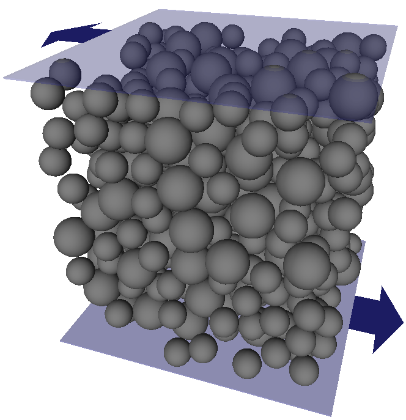
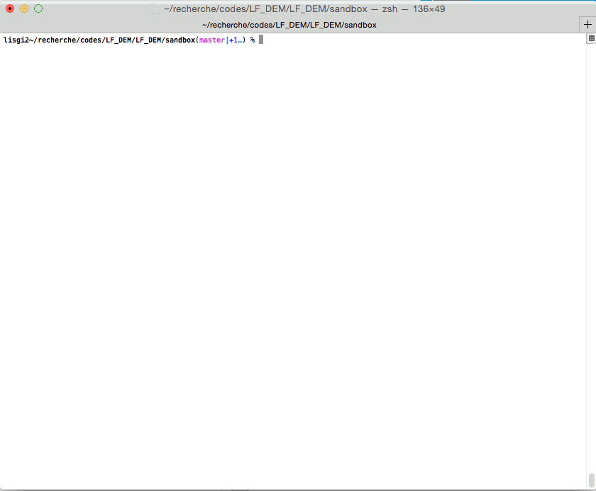

LF\_DEM
=======

+------------------------------------------------------------------------------------------------------------------------------------------------------------------------------------------------------------------+-------------------------------------------------------------+
| **A code simulating simple shear flow of dense, overdamped suspensions of spherical particles. It includes hydrodynamics, contacts (with several contact models), potential interactions, and Brownian motion.** | |image0|                                                    |
+------------------------------------------------------------------------------------------------------------------------------------------------------------------------------------------------------------------+-------------------------------------------------------------+

Requirements
------------

LF\_DEM needs a C++11 compatible compiler.

LF\_DEM requires the sparse linear algebra software `SuiteSparse
<http://faculty.cse.tamu.edu/davis/suitesparse.html>`__ to be
installed. SuiteSparse is easy to compile from sources. For Ubuntu
users, there is a SuiteSparse package `libsuitesparse-dev` which is
not the latest SuiteSparse version, but is the simplest possible
installation.

Getting the code
----------------

By using git
~~~~~~~~~~~~

We strongly encourage to use the version control system Git (for `Mac OS
X <http://git-scm.com/download/mac>`__, for
`Linux <http://git-scm.com/download/linux>`__). This will allow you to
get updates of the code in a very easy and clean way and to contribute
to the code by sending bug fixes or new features with a minimal effort.

You can get the code by typing in a terminal:

::

    $ git clone https://bitbucket.org/rmari/lf_dem.git

This will download the current sources (and also the past sources).

Intro to git `short <https://try.github.io/levels/1/challenges/1>`__,
or `more complete <https://git-scm.com/docs/gittutorial>`__.

By direct download
~~~~~~~~~~~~~~~~~~

Download from here (bitbucket.org) by clicking the download icon
(cloud), select "Download repository" and unzip.

Installation
------------

SuiteSparse
~~~~~~~~~~~

To install SuiteSparse (prior to version 4.5) on CUNY-HPPC, see `these
instructions <./SuiteSparse_Install.md>`__. Later versions of SuiteSparse
have a different build process (see below), untested so far on CUNY-HPPC.

Be aware that SuiteSparse switched from building a static
library to building a dynamic library from version 4.5.3.
In the latter case, keep in mind that you have to access the shared version
of the library at runtime. Three ways to do it:

- install SuiteSparse in a default library folder (e.g. ``/usr/local/`` on GNU/Linux),
typically only possible if you have SU privileges on your machine,

- compile LF_DEM by providing the path to ``libcholmod`` at linking stage with the ``-Wl,-rpath`` option
(the Makefile takes care of that if the lib is called ``libcholmod.so``, but not otherwise)

- append SuiteSparse install folder to your LD path
(usually via ``LD_LIBRARY_PATH`` on GNU/Linux)

LF_DEM
~~~~~~

The compilation is done with ``make``. The ``Makefile`` is in the ``LF_DEM/`` folder.
This file uses some environment variables (defining the compiler, the include paths and flags to be used
to compile) that you have to provide in ``LF_DEM/config/Makefile_config.mk``.
The file ``Makefile_config.mk`` is not provided in the sources
because it contains variables that will depend on your environment.
You can create  ``Makefile_config.mk`` by modifying the example configurations provided in the
``LF_DEM/config/`` folder. There is a bunch of ``Makefile_config.mk`` examples
under the names ``LF_DEM/config/Makefile_config_*``, from which you can cook
your own.

If you compiled a shared version of SuiteSparse lib, it can most probably take advantage
of the Metis ordering lib (coming with recent SuiteSparse versions).
The experience shows that in most cases the Metis ordering is the one picked by SuiteSparse for the kind
of matrices generated by LF_DEM in simple shear of dense suspensions,
so if this is your usecase you may slightly optimize the performance by using only Metis ordering
(thus skipping best ordering determination) by setting ``UseMetis = yes``
in your ``Makefile_config.mk``.

Once you created ``Makefile_config.mk``, you can simply compile in a
terminal via:

::

    $ make
    $ make install

The second command is only needed if you want to install ``LF_DEM`` in
the given ``install_dir``.

Usage
-----

Running a simulation
~~~~~~~~~~~~~~~~~~~~

LF\_DEM takes two kinds of inputs, command-line arguments and parameter
files. The general syntax is:

::

    $ LF_DEM [-r shear_rate ] [-s shear_stress ] [-k kn_kt_File] Configuration_File Parameter_File

where ``Configuration_File`` contains the initial positions and
``Parameter_File`` the (many) simulation parameters. Either the shear
rate or the shear stress must be given in input (but not both). You must
enter them with their units as a suffix (see below). The ``kn_kt_File``
is an optional file which specifies the contact stiffnesses as a
function of the volume fraction and shear rate.

Input of units
^^^^^^^^^^^^^^

LF\_DEM is designed to work with several unit scales, each based on a
force scale. As a consequence the user must specify the units in input,
by appending a literal suffix to the numeral value. The list of
suffixes corresponding to the forces currently implemented in LF\_DEM is
the following:

+---------------------------------+----------+
| Set of unit                     | Suffix   |
+=================================+==========+
| Repulsive force                 | "r"      |
+---------------------------------+----------+
| Brownian force                  | "b"      |
+---------------------------------+----------+
| Cohesion                        | "c"      |
+---------------------------------+----------+
| Critical Load                   | "cl"     |
+---------------------------------+----------+
| Normal contact stiffness        | "kn"     |
+---------------------------------+----------+
| Tangential contact stiffness    | "kt"     |
+---------------------------------+----------+
| Rolling contact stiffness       | "kr"     |
+---------------------------------+----------+

For example, if using repulsive force and a Brownian force, one can
specify in the ``Parameter_File``:

``
repulsion_amplitude = 3.2b;
``

which
will tell LF\_DEM to work with an repulsive force with amplitude :math:`3.2kT/a` at contact (with :math:`kT` the temperature and :math:`a` the typical radius of a particle).

There is always one "special" force scale which gives a meaning (a unit)
to the shear rate or the shear stress. Hence, to work with Peclet 5 you
must input ``LF_DEM -r 5b``, to work with a stress of :math:`4F_R^{\ast}/a^2`, you must input ``LF_DEM -s 4r``.

Note that the suffix notation is not limited to forces. For example, the simulation
length can be set with

``time_end = 100b;``

in which case the simulation
will run for :math:`100\times 6\pi\eta_0 a^3/kT`, or with

``time = 100h;``

in which case it will run for :math:`100 \dot\gamma^{-1}`, ie :math:`100` strain units.

Configuration file
^^^^^^^^^^^^^^^^^^

The initial configuration can be generated by LF\_DEM, see `Initial
configurations <#initial>`__.

Parameter file
^^^^^^^^^^^^^^

The list of all possible parameters and their description is available
in html format in ``LF_DEM/html/struct_parameter_set.html``. This file
can also be viewed online
`here <http://rmari.bitbucket.org/LF_DEM_doc/struct_parameter_set.html>`__.
(If none of this works for you, the complete list of parameters is kept
in ``LF_DEM/ParameterSet.h``.)

Although none of these parameters is compulsory (the simulation can run
with default hard-coded values), as much as possible they should be
provided by the user. One example of input parameter file is given in
the file ``nobrownian_2D.txt``.

Rate-controlled mode
^^^^^^^^^^^^^^^^^^^^

It is selected by ``-r`` followed by the value of the shear rate (with
suffix for units!): |image1|

Stress-controlled mode
^^^^^^^^^^^^^^^^^^^^^^

It is selected by ``-s`` followed by the value of the stress (with a
unit too). It does not work in the Brownian case.

Other options
^^^^^^^^^^^^^

No documentation for this yet. Many options are temporary.

Initial configurations
~~~~~~~~~~~~~~~~~~~~~~

Initial configurations can be generated through:

::

    $ LF_DEM -g Random_Seed

LF\_DEM will ask to input a series of parameters (number of particles,
dimension, etc). The generated configuration is written in a file with a
parameter dependant filename ``D*N*VF*.dat``. An extra
``D*N*VF*.dat.yap`` is also generated to visualize the generated
configuration with `yaplot <https://github.com/vitroid/Yaplot>`__ or
`homer <https://github.com/rmari/homer>`__.

Alternatively, you can generate initial configurations with the
`LFDEM_confgen.py <https://github.com/rmari/pyLF_DEM_toolbox>`__ utility built
upon `pyLF_DEM <https://github.com/rmari/pyLF_DEM>`__ (see below).

Python wrapper
~~~~~~~~~~~~~~

There is a `Python wrapper <https://github.com/rmari/pyLF_DEM>`__
for ``LF_DEM`` that can be used to control the protocol
(e.g. to impose a complex strain rate protocol) with the flexibility
of a Python script.

Complementary documentation
---------------------------

A source code documentation is maintained `here <http://rmari.bitbucket.org/LF_DEM_doc/>`__.

